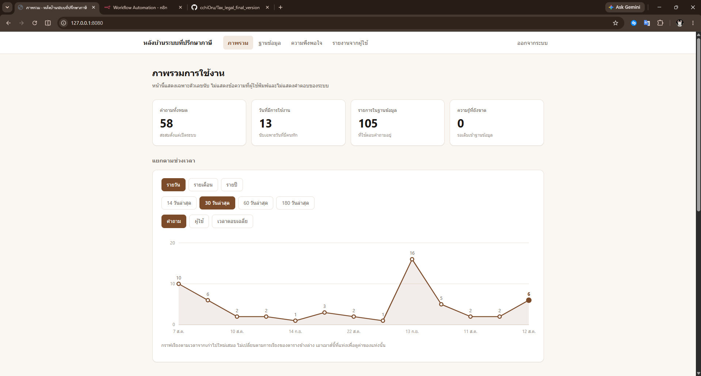

# ระบบที่ปรึกษาด้านภาษีด้วยปัญญาประดิษฐ์บนไลน์ โดยใช้ระบบอัตโนมัติ

Development of an AI-Based Tax Advisory System on LINE Using Workflow Automation

ปริญญานิพนธ์ระดับปริญญาตรี ภาควิชาวิทยาการคอมพิวเตอร์และเทคโนโลยีสารสนเทศ
คณะวิทยาศาสตร์ มหาวิทยาลัยนเรศวร

ผู้จัดทำ นายยศกร แจ้งมณี และนางสาวณัฏฐณิชา ป้องป้อม
อาจารย์ที่ปรึกษา ผู้ช่วยศาสตราจารย์ ดร.สัญญา เครือหงษ์

---

## ระบบนี้คืออะไร

แชตบอตใน LINE ที่ตอบคำถามภาษีเงินได้บุคคลธรรมดา พิมพ์ถามเหมือนคุยกับคน
ตอบกลับพร้อมบอกว่าอ้างอิงกฎหมายมาตราไหน

```
คุณ : เงินเดือน 50,000 บาทต่อเดือน ประกันสังคม 9,000 บาท ต้องเสียภาษีเท่าไหร่

บอท : ภาษีที่ต้องชำระคือ 20,600 บาทค่ะ 📊
      เงินได้ทั้งปี 600,000 บาท
      หักค่าใช้จ่าย 100,000 บาท
      หักลดหย่อนส่วนตัว 60,000 บาท และประกันสังคม 9,000 บาท
      เงินได้สุทธิคงเหลือ 431,000 บาท
      ภาษีที่ต้องชำระ 20,600 บาท
```

ถามได้ทั้งการคำนวณภาษี ค่าลดหย่อนแต่ละอย่าง กำหนดยื่นและแบบที่ต้องใช้
ค่าปรับเมื่อยื่นช้า และขอให้ยกถ้อยคำของมาตราที่ต้องการมาดู

**สิ่งที่ต่างจากการถาม ChatGPT** คือตัวเลขทุกตัวมาจาก deterministic code ที่มี unit test กำกับ
ไม่ใช่แบบจำลองคิดเอง ถามคำถามเดิมสิบครั้งได้คำตอบเดิมทุกครั้ง
สถาปัตยกรรมเป็นแบบ RAG คือค้นจากตาราง `tax_law_knowledge` 105 รายการก่อน
แล้วให้แบบจำลองเรียบเรียงคำตอบจากข้อมูลที่ค้นได้เท่านั้น

### หน้าหลังบ้านสำหรับผู้ดูแล



เปิดที่ http://localhost:8080 มีสี่หน้า คือ ภาพรวม ฐานข้อมูล ความพึงพอใจ และรายงานจากผู้ใช้

หน้าหลังบ้านใช้บัญชี `tax_admin_readonly` ซึ่งถูก REVOKE สิทธิ์จากตารางต้นทางทั้งหมด
และได้สิทธิ์อ่านเฉพาะ view ที่สรุปมาแล้ว ผู้ดูแลจึงเห็นสถิติได้แต่อ่านคำถามของผู้ใช้ไม่ได้

---

## สถาปัตยกรรม

```
ผู้ใช้ (แอป LINE)  →  LINE Messaging API + Rich Menu 6 ปุ่ม  →  ngrok  →  n8n Workflow 41 โหนด

 1. แยกเหตุการณ์จาก LINE
      ├─ กดเพิ่มเพื่อน   → ขอความยินยอมเก็บข้อมูลก่อนเริ่มใช้งาน
      ├─ กดปุ่มตอบ      → บันทึกความยินยอม แล้วแสดงคำเตือนการใช้งานครั้งเดียว
      ├─ กดปุ่ม postback → บันทึกรายงานปัญหาจากผู้ใช้
      └─ พิมพ์ข้อความ   → เข้าสู่การตอบคำถามด้านล่าง
 2. ดักคำสั่งจัดการข้อมูลของตัวเอง เช่น ลบข้อมูลของฉัน
 3. ดักคำทักทายและปุ่มเมนู ตอบด้วยข้อความสำเร็จรูปโดยไม่เรียกแบบจำลอง
 4. ดึงโปรไฟล์ผู้ใช้จาก LINE แล้วบันทึกลง PostgreSQL
 5. retrieval จาก knowledge base ด้วย keyword matching 382 คู่
 6. intent classification ด้วยกฎ ถ้าต้องได้ตัวเลขจะแนบคำสั่งบังคับเรียก tool
 7. แยกเส้นทางตาม consent
      ├─ granted → AI Agent ที่ต่อ conversation memory และบันทึกบทสนทนา
      └─ denied  → AI Agent ที่ไม่ต่อ memory และไม่บันทึกอะไรเลย
 8. AI Agent
      ├─ LLM: Gemini 3.1 Flash Lite
      ├─ tool: คำนวณภาษีเงินได้บุคคลธรรมดา  (มีด่านตรวจ 4 ชั้นก่อนคำนวณ)
      ├─ tool: คำนวณเงินเพิ่มและค่าปรับ
      └─ tool: ค้นตัวบทประมวลรัษฎากร 309 มาตรา
 9. post-processing ก่อนส่งออก
      ├─ ลบ Markdown ทิ้ง เพราะ LINE ไม่ render
      ├─ ด่านตัวเลข ตรวจว่าเลขในคำตอบตรงกับผลเครื่องคำนวณ
      └─ ตัดความยาวที่ขอบบรรทัด ไม่ให้ผู้ใช้ต้องกด "ดูเพิ่มเติม"
10. เลือกช่องทางส่งตาม latency ที่วัดได้
      ├─ < 50 วินาที → Reply API ซึ่งใช้ฟรีไม่จำกัด
      └─ ≥ 50 วินาที → Push API เพราะ reply token หมดอายุแล้ว
11. บันทึกบทสนทนา เฉพาะผู้ใช้ที่ยินยอมเท่านั้น
```

**ด่านตรวจ 4 ชั้นก่อนคำนวณ** ทุกด่านปฏิเสธไม่คำนวณให้เลยเมื่อพบปัญหา ไม่ส่งตัวเลขกลับไปพร้อมคำเตือน
เพราะวัดแล้วพบว่าคำเตือนที่แนบไปพร้อมตัวเลขถูกเมิน 3 จาก 3 รอบ
แต่การไม่ให้ตัวเลขเลยทำให้แบบจำลองยอมเรียกเครื่องมือใหม่ทันที

1. **คีย์วางผิดชั้น** เช่นส่ง `spouse` ไว้ชั้นบนสุดแทนที่จะอยู่ใน `allowances` ค่าลดหย่อนจะหาย ภาษีสูงเกินจริง
2. **ค่าผิดชนิด** เช่นส่ง `income.profession` เป็นข้อความ `Number()` อ่านไม่ออกจึงเป็น 0 เงียบ ๆ เงินได้หาย ภาษีต่ำเกินจริง
3. **ประเภทเงินได้ขัดแย้งกัน** เช่นระบุว่าเป็นวิชาชีพแพทย์แต่ไม่มีเงินได้ในช่องวิชาชีพ
4. **ที่มาของค่าลดหย่อน** ตัดค่าลดหย่อนที่ผู้ใช้ไม่ได้เอ่ยถึงออก กันแบบจำลองเติมตัวเลขเอง

**ทำไมไม่ใช้ vector search** ภาษาไทยเขียนติดกันโดยไม่มีช่องว่างระหว่างคำ PostgreSQL Full-Text Search
จึงทำ tokenization ไม่ได้ วัดจากข้อมูลจริงแล้ว retrieval hit rate เป็นศูนย์
เปลี่ยนมาใช้ domain-specific keyword matching ที่สร้างขึ้นเอง 382 คู่ แล้วได้ hit rate 100%
เป็นข้อจำกัดของภาษาไทยที่งานภาษาอังกฤษไม่เจอ และเป็นผลการทดลองที่รายงานไว้ในบทที่ 4

---

## ฐานข้อมูล

| ตาราง | จำนวน | ใช้ทำอะไร |
|---|---|---|
| `tax_law_knowledge` | 105 รายการ | ใช้ตอบคำถามผู้ใช้ เรียบเรียงเป็นภาษาที่คนทั่วไปเข้าใจ ตัวเลขที่บังคับใช้จริงปี 2567 |
| `revenue_code_current` | 309 มาตรา | ยกถ้อยคำของกฎหมายเมื่อผู้ใช้ถามถึงมาตราโดยตรง ดึงจาก rd.go.th |
| `revenue_code_sections` | ฉบับ พ.ศ. 2482 | **ไม่ใช้แล้ว** ตัวเลขล้าสมัยทั้งหมด เก็บไว้เป็นบันทึกการทดลอง |

> **ข้อควรระวังที่สำคัญที่สุดของระบบ** ห้ามนำตัวเลขจากตัวบทกฎหมายไปตอบคำถามเรื่องเงิน
> เพราะหลายมาตราถูกกฎกระทรวงหรือพระราชกฤษฎีกาแก้ค่าในภายหลัง ตัวอย่างชัดที่สุดคือ
> มาตรา 47(1)(ง) เขียนว่าเบี้ยประกันชีวิตหักได้ 10,000 บาท แต่ค่าที่ใช้จริงคือ 100,000 บาท
> ตามกฎกระทรวงฉบับที่ 126

---

## ผลการทดลอง

**ข้อค้นพบหลัก สั่งด้วย prompt อย่างเดียวไม่พอ** ตอนแรกเขียนกฎลงใน system prompt ทั้งหมด
ผลคือแบบจำลองทำตามบ้างไม่ทำตามบ้าง เมื่อย้ายกฎเดียวกันไปบังคับด้วยโค้ด ผลดีขึ้นชัดเจน

> **สิ่งที่ต้องรับประกันได้ ห้ามฝากไว้กับ prompt ต้องบังคับใน deterministic code เท่านั้น**

วัดจากคำถาม 155 ข้อที่อ้างอิงกฎหมายจริง รันสามรอบเป็น 465 ครั้ง
ผลที่คัดไว้อ้างอิงในรายงานอยู่ที่ `evaluation/results/published/`

การวัดผูกกับ configHash ซึ่งเป็นค่าแฮชของไฟล์เวิร์กโฟลว์ เครื่องคำนวณ และฐานความรู้
ถ้าแก้ไฟล์เหล่านั้น ผลเดิมจะถูกทิ้งและต้องวัดใหม่ทั้งหมด ตัวเลขที่รายงานจึงตรงกับโค้ดที่ใช้งานจริงเสมอ

```bash
node --test tests/*.js                                  # ชุดทดสอบ 320 ข้อ ไม่ต่อเน็ต ไม่เสียโควตา
node evaluation/run-accuracy-test.js --model=gemini --runs=3   # วัดจริง 465 ครั้ง หยุดแล้วรันต่อได้
node evaluation/inspect-failures.js                     # ดูข้อที่ตอบผิด พร้อมค่าที่ส่งเข้าเครื่องคำนวณ
```

---

## ติดตั้งและใช้งาน

**ต้องติดตั้ง** Docker Desktop, Node.js 20+, Python 3.10+
**ต้องสมัคร** (ฟรีทั้งหมด) บัญชี Google เพื่อขอ API key ของ Gemini ที่
[aistudio.google.com/apikey](https://aistudio.google.com/apikey) ·
[ngrok](https://dashboard.ngrok.com/signup) · LINE Official Account ที่เปิด Messaging API แล้ว

**1 ดาวน์โหลดและตั้งค่า**

```bash
git clone https://github.com/cchiOru/Tax_legal_final_version.git
cd Tax_legal_final_version
cp .env.example .env
```

เปิด `.env` แล้วใส่ค่าจริง 6 บรรทัด คือ `POSTGRES_PASSWORD`, `N8N_ENCRYPTION_KEY`,
`NGROK_AUTHTOKEN`, `LINE_CHANNEL_ACCESS_TOKEN`, `LINE_CHANNEL_SECRET`, `GEMINI_API_KEY`
บรรทัดอื่นปล่อยไว้ได้ **ห้ามอัปโหลด `.env` ขึ้นที่สาธารณะเด็ดขาด**

**2 เปิดระบบ**

```bash
docker compose up -d && docker compose ps
```

ต้องขึ้นครบ 4 ตัวและมีสถานะ running หรือ healthy คือ `tax-advisor-postgres`,
`tax-advisor-n8n`, `tax-advisor-ngrok`, `tax-advisor-admin`

**3 ใส่ความรู้เรื่องกฎหมายภาษี**

```bash
for f in seed-tax-law seed-tax-law-extra seed-tax-law-full \
         seed-tax-law-cases seed-tax-forms seed-tax-law-deductions-detail \
         seed-tax-law-exempt-and-freelance seed-tax-law-social-security \
         seed-tax-law-modern-income seed-tax-law-how-to-ask \
         seed-tax-law-withholding-and-treaty; do
  docker cp postgres/$f.sql tax-advisor-postgres:/tmp/
  docker exec tax-advisor-postgres psql -U n8n_admin -d tax_advisor -f /tmp/$f.sql
done

for m in postgres/migrations/*.sql; do
  docker cp $m tax-advisor-postgres:/tmp/m.sql
  docker exec tax-advisor-postgres psql -U n8n_admin -d tax_advisor -f /tmp/m.sql
done
```

ตรวจว่าเข้าครบ ต้องได้ **105** จากนั้นดึงตัวบทประมวลรัษฎากรฉบับปัจจุบันจากเว็บกรมสรรพากร

```bash
docker exec tax-advisor-postgres psql -U n8n_admin -d tax_advisor -c "SELECT count(*) FROM tax_law_knowledge;"
python postgres/import-revenue-code-current.py
```

**4 สร้างและนำเข้าเวิร์กโฟลว์**

```bash
python n8n/build-workflow.py
```

เปิด http://localhost:5678 สร้างบัญชีผู้ดูแล กด **Import from File** เลือก
`n8n/workflows/tax-advisor-workflow.json` ผูก credential ให้ครบ
(PostgreSQL 8 โหนด, Google Gemini 1 โหนด) แล้วกดสวิตช์ **Active**

ค่าที่ใช้ผูก credential ของ PostgreSQL คือ Host `postgres` · Database `tax_advisor` ·
User `n8n_admin` · Port `5432` · Password ใช้ค่าเดียวกับ `POSTGRES_PASSWORD`

> Host ต้องเป็น `postgres` ไม่ใช่ `localhost` เพราะ n8n มองหาฐานข้อมูลจากในเครือข่ายของ Docker

ผูกเสร็จแล้วคัดลอกรหัส credential จากแถบที่อยู่ ใส่ลงใน `.env` ที่ `N8N_PG_CREDENTIAL_ID`
และ `N8N_LLM_CREDENTIAL_ID` ครั้งต่อไป `build-workflow.py` จะผูกมาให้เลย

**5 ต่อ LINE และติดตั้งเมนูปุ่มกด**

```bash
docker compose logs ngrok | grep "url="       # ได้ https://xxxx.ngrok-free.app
pip install pillow requests
python line/setup-rich-menu.py --clean
```

เอาที่อยู่ ngrok ต่อท้ายด้วย `/webhook/line-webhook` วางในช่อง Webhook URL ของ
LINE Developers Console แล้วเปิดสวิตช์ Use webhook

> ที่อยู่ ngrok เปลี่ยนทุกครั้งที่รีสตาร์ต ถ้าบอทเงียบไปเฉย ๆ ให้เช็คตรงนี้ก่อนเสมอ

**6 ทดลองใช้** เพิ่มเพื่อนจาก QR code แล้วพิมพ์ถาม ถ้าตอบว่า **20,600 บาท** แปลว่าติดตั้งสำเร็จ

```
เงินเดือน 50,000 บาทต่อเดือน ประกันสังคม 9,000 บาท ต้องเสียภาษีเท่าไหร่
```

---

## โครงสร้างไฟล์

```
n8n/build-workflow.py            แหล่งความจริงหนึ่งเดียวของเวิร์กโฟลว์ ห้ามแก้ JSON ตรง ๆ
n8n/tools/tax-calculator.js      เครื่องคำนวณภาษีและด่านตรวจ แยกไว้เพื่อให้ทดสอบได้
n8n/ollama/                      ค่าปรับแต่งแบบจำลองที่รันในเครื่อง
postgres/seed-tax-law*.sql       knowledge base 105 รายการ
postgres/migrations/             การเปลี่ยนแปลงโครงสร้างตารางตามลำดับ
evaluation/test-questions-official.json   ชุดคำถาม 155 ข้อพร้อมแหล่งอ้างอิง
evaluation/run-accuracy-test.js  วัดความแม่นยำของค่าที่ใช้จริง
evaluation/results/published/    ผลการวัดที่คัดไว้อ้างอิงในรายงาน
admin/                           หน้าหลังบ้านสำหรับผู้ดูแล
tests/                           ชุดทดสอบที่ไม่เรียก API
line/setup-rich-menu.py          สร้างและติดตั้งเมนู 6 ปุ่มบน LINE
assets/                          ภาพประกอบของเอกสารนี้
docs/                            เอกสารประกอบ ไม่อยู่ใน git เก็บในเครื่องเท่านั้น
```

---

## เอกสารประกอบ

เอกสารฉบับเต็มอยู่ในโฟลเดอร์ `docs/` ซึ่ง **ไม่ได้เผยแพร่ใน repository นี้**
เพราะมีร่างปริญญานิพนธ์ซึ่งเป็นงานที่ยังไม่ได้ส่ง ภายในมีร่างบทที่ 1 ถึง 5
คู่มือติดตั้งฉบับละเอียดสำหรับผู้ที่ไม่เคยเขียนโปรแกรม บันทึกที่มาของข้อมูลทุกชุด
พร้อมสัญญาอนุญาตของซอฟต์แวร์ที่นำมาใช้ และประกาศความเป็นส่วนตัวตาม พ.ร.บ. คุ้มครองข้อมูลส่วนบุคคล

ขั้นตอนที่จำเป็นต่อการติดตั้งและใช้งานอยู่ในไฟล์นี้ครบแล้ว หากต้องการเอกสารฉบับเต็ม กรุณาติดต่อผู้จัดทำ

---

## ข้อจำกัดของระบบ

**ยังไม่เคยทดสอบกับผู้ใช้จริงในวงกว้าง** ตัวเลขความแม่นยำวัดจากคำถามที่ผู้จัดทำสร้างขึ้นเอง
คำถามจากผู้ใช้จริงมักกำกวมและมีบริบทเฉพาะตัวมากกว่า ข้อจำกัดนี้ไม่ใช่การคาดเดา
ตอนที่ชุดคำถามได้คะแนนเต็ม การลองพิมพ์ถามด้วยมือเพียงไม่กี่คำถามกลับพบข้อบกพร่อง 4 จุด
ที่ชุดคำถามจับไม่ได้เลย ทั้งหมดเกิดจากการถามต่อเนื่องหลายจังหวะและการใช้ภาษาแบบที่คนพิมพ์จริง

**ขอบเขตจำกัดเฉพาะภาษีเงินได้บุคคลธรรมดา ปีภาษี 2567** ยังไม่รองรับภาษีเงินได้นิติบุคคล
และภาษีมูลค่าเพิ่มอย่างเต็มรูปแบบ

**พึ่งบริการภายนอกที่ควบคุมโควตาไม่ได้** ระหว่างวัดผลพบว่าโควตาฟรีหมดกลางคัน
การนำไปใช้จริงกับผู้ใช้จำนวนมากจึงต้องประเมินค่าใช้จ่ายส่วนนี้ก่อน

**แบบจำลองที่รันในเครื่องยังตอบช้ากว่าเกณฑ์** การ์ดจอที่ใช้พัฒนามีหน่วยความจำ 4 GB
ส่วนตัวแบบจำลองใช้ 3.6 GB จึงต้องแบ่งงานบางส่วนไปรันบน CPU
ผลการทดลองปรับค่าต่าง ๆ บันทึกไว้ใน `n8n/ollama/Modelfile.typhoon-tax`

---

## สัญญาอนุญาตและการอ้างอิง

ข้อมูลกฎหมายภาษีมาจากเว็บไซต์กรมสรรพากร https://www.rd.go.th
ซึ่งเป็นเอกสารราชการที่เผยแพร่ต่อสาธารณะ ซอฟต์แวร์ที่นำมาใช้และแหล่งข้อมูลทั้งหมด
พร้อมสัญญาอนุญาตของแต่ละรายการ บันทึกไว้ใน `docs/` ซึ่งเก็บไว้ในเครื่องผู้จัดทำ

---

ระบบนี้เป็นผลงานการศึกษา ไม่ใช่บริการให้คำปรึกษาทางภาษี
คำตอบที่ได้ควรตรวจสอบกับกรมสรรพากรก่อนนำไปใช้ตัดสินใจจริงเสมอ
